# Base de Conocimiento: Ecosistema de Sorters y Observabilidad End-to-End

Bienvenido a la Base de Conocimiento oficial para la arquitectura, operación y observabilidad del ecosistema de **Sorters (Sistemas de Clasificación Automatizada)** de **Andreani Logística**.

Este repositorio centraliza toda la documentación técnica, diagramas de arquitectura, inventario de componentes y estrategias de monitoreo, con el objetivo de garantizar la trazabilidad integral, disponibilidad operativa y resolución ágil de incidentes.

> 🌐 **Portal Home Page Unificado:** Abre directamente [**`Sorters.html`**](./Sorters.html) en cualquier navegador para recorrer toda la documentación, diagramas vectoriales interactivos y fichas técnicas con identidad corporativa Andreani Cartesian.

---

## 🧭 Mapa de Navegación del Repositorio

### 📚 Documentación Técnica Oficial (`docs/`)
Todo el trabajo y especificaciones del proyecto se concentran en [**`docs/`**](./docs/README.md):

| Documento / Carpeta | Descripción | Audiencia Principal |
| :--- | :--- | :--- |
| 🌐 [**Sorters.html (Home Page)**](./Sorters.html) | Portal web interactivo con menú lateral, buscador, visualizador zoom y modo oscuro/claro. | Toda la Organización |
| 📘 [**01. Arquitectura General y Ecosistema**](./docs/01-arquitectura-general.md) | Visión macro del negocio logístico, tipología de Sorters (Vertical, TruxSorter, Wayzim, Giops, Regionales) y capas tecnológicas (TMS, SPP, Bases AlwaysOn, Hardware). | Arquitectura, Líderes Técnicos, Operaciones |
| ⚡ [**02. Flujo End-to-End: Vertical Sorter**](./docs/02-flujo-end-to-end-vertical.md) | Recorrido paso a paso del flujo de datos y paquetería desde la ingesta del cliente hasta la inducción física, clasificación y retroalimentación a dashboards. Incluye resiliencia de Rampa 6. | Desarrolladores, SysAdmins, Observabilidad |
| 📋 [**03. Catálogo e Inventario de Componentes**](./docs/03-inventario-componentes.md) | Inventario consolidado de más de 50 componentes: APIs, Workers en K8s (CCE/AKS-BR/K3H/K3S), Tópicos de Kafka, Bases de Datos SQL/Redis y listado de PCs industriales. | SRE, DevOps, Monitoreo, Soporte L2/L3 |
| 🎯 [**04. Estrategia de Observabilidad Integral**](./docs/04-estrategia-observabilidad.md) | Matriz de observabilidad en 4 pilares: Métricas clave (SLIs/SLOs), Logs/APM, Health Checks sintéticos, Matriz de alarmado (P1 a P3) y Runbooks de contingencia. | Equipos de Observabilidad, Centro de Control (NOC), Guardia |
| 🗺️ [**05. Diagrama E2E y Sensores de Monitoreo**](./docs/05-flujo-observabilidad.md) | Mapa visual que detalla el flujo de datos junto con los 10 sensores de monitoreo recomendados (S1 a S10) y mitigación de SPOFs. | Todos los equipos técnicos |
| 📦 [**06. Ecosistema SPP (tyd-spp)**](./docs/06-ecosistema-spp.md) | Catálogo oficial de las 42 aplicaciones del proyecto SPP sincronizadas desde GitOps, con repositorios GitHub, estados y métricas. | Arquitectura, SPP, Observabilidad |
| 🎨 [**docs/diagramas/**](./docs/diagramas/README.md) | Repositorio centralizado con todos los diagramas vectoriales SVG, renders PNG y visor HTML interactivo. | Arquitectura y Observabilidad |

> 🎨 *Nota técnica interna:* El repositorio incluye la especificación de diseño Andreani Cartesian en [**`docs/guia-estilos-cartesian.md`**](./docs/guia-estilos-cartesian.md) y estilos en [**`docs/assets/cartesian.css`**](./docs/assets/cartesian.css) para uso exclusivo de desarrollo del portal.

---

### 📁 Relevamiento y Fuentes de Campo (`relevamiento/`)
En [**`relevamiento/`**](./relevamiento/README.md) se organizan los materiales de origen agrupados por tipología:

- 🎙️ [**`relevamiento/reuniones/`**](./relevamiento/reuniones/README.md): Minuta técnica (`Observabilidad integral de los Sorters 01.docx`) y grabación en video de la sesión de arquitectura (`.mp4`).
- 📐 [**`relevamiento/diagramas/`**](./relevamiento/diagramas/README.md): Fuentes preliminares y diagramas editables de trabajo (`mapa de monitoreo sorter.drawio`, `Diagrama01.png`).
- 📊 [**`relevamiento/planillas/`**](./relevamiento/planillas/README.md): Matriz técnica de relevamiento (`Toma_de_Servicio - Sorters.xlsx`) y exportación de aplicaciones (`aplicaciones_*.xlsx`).

---

### 🛠️ Scripts y Automatización (`scripts/`)
En [**`scripts/`**](./scripts/README.md) se centralizan las herramientas operativas del repositorio:

- 🌐 [**`scripts/preview.bat`**](./scripts/preview.bat): Inicia el servidor local de previsualización en `http://localhost:3000`.
- 🚀 [**`scripts/push.bat`**](./scripts/push.bat): Empuja cambios pendientes a ambos repositorios GitHub simultáneamente.
- 🔄 [**`scripts/sync.bat`**](./scripts/sync.bat): Acceso rápido para sincronizar las aplicaciones SPP con la plataforma GitOps.
- 🐍 [**`scripts/sync-gitops.py`**](./scripts/sync-gitops.py): Motor de sincronización automática (vía API REST o exportación Excel).

## 📌 Contexto de Negocio y Rol de los Sorters

En la cadena logística de Andreani, los **Sorters** son los dispositivos electromecánicos e informáticos de alta velocidad encargados de:
1. **Identificar** bultos mediante lectores ópticos de código de barras.
2. **Aforar** (pesar y medir dimensiones volumétricas) en movimiento de forma dinámica.
3. **Clasificar y rutear** automáticamente cada paquete hacia la rampa o boca de salida correspondiente según su destino final.

El sistema pivote que articula la lógica de negocio y prepara los datos para las máquinas es el **SPP (Sistema de Paquetería y Procesamiento)**.

---

## 🏗️ Arquitectura en Capas Resumida

---

## 💡 Hito Inicial: Vertical Sorter (CIT 1° Piso)

Siguiendo las definiciones del equipo de Arquitectura y Observabilidad, el primer hito de modelado y monitoreo integral se focaliza en el **Vertical Sorter**. 
Este clasificador reúne todos los desafíos de integración:
- Microservicios en Kubernetes (`TYD-SPP` y `TYD-SORTERS`)
- Eventos asíncronos en Apache Kafka (AMQ Streams)
- Base de datos relacional en alta disponibilidad AlwaysOn (`DBSORTER` e `Integración Vertical`)
- Almacenamiento de estado y cursor en Redis (`DBSORTERPROD`)
- Interfaz bidireccional con software de fabricante
- Hardware de control industrial
- Circuito de auto-recuperación de excepciones por Rampa 6 (`job-spptovertical`)

Una vez consolidado y monitoreado este circuito, el modelo se replica para los demás tipos de clasificadores de la red (Wayzim, Giops y Regionales).
