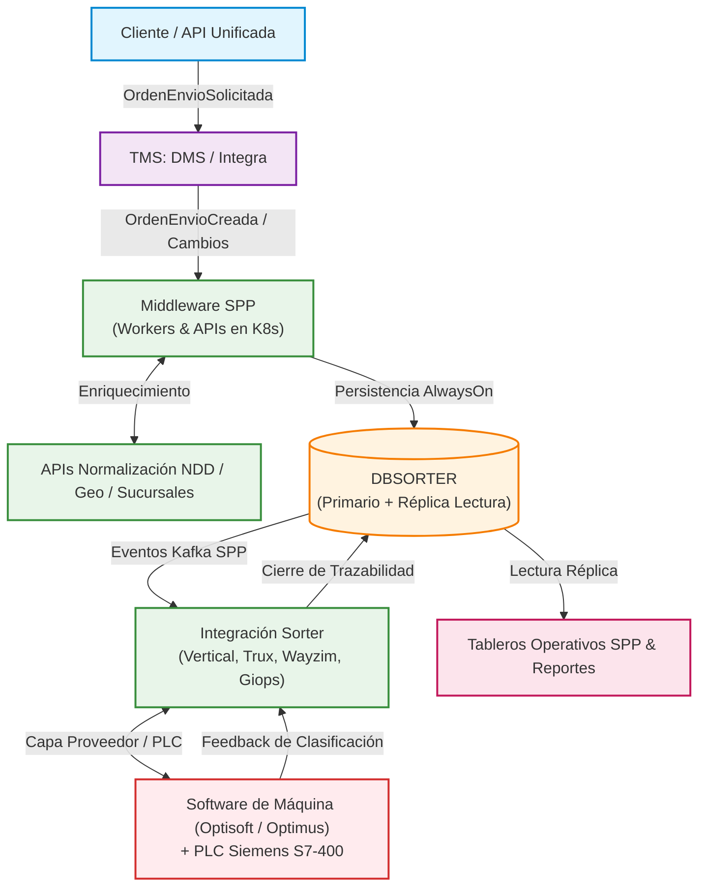

# Base de Conocimiento: Ecosistema de Sorters y Observabilidad End-to-End

Bienvenido a la Base de Conocimiento oficial para la arquitectura, operación y observabilidad del ecosistema de **Sorters (Sistemas de Clasificación Automatizada)** de **Andreani Logística**.

Este repositorio centraliza toda la documentación técnica, diagramas de arquitectura, inventario de componentes y estrategias de monitoreo, con el objetivo de garantizar la trazabilidad integral, disponibilidad operativa y resolución ágil de incidentes.

> 🌐 **Portal Home Page Unificado:** Puedes abrir directamente [**`Sorter.html`**](./Sorter.html) en cualquier navegador para recorrer toda la documentación, diagramas vectoriales y fichas técnicas de manera interactiva.

---

## 🧭 Mapa de Navegación

| Documento / Carpeta | Descripción | Audiencia Principal |
| :--- | :--- | :--- |
| 🌐 [**Sorter.html (Home Page)**](./Sorter.html) | Portal web interactivo con menú lateral y visualización integrada de todos los documentos y diagramas. | Toda la Organización |
| 📘 [**01. Arquitectura General y Ecosistema**](docs/01-arquitectura-general.md) | Visión macro del negocio logístico, tipología de Sorters (Vertical, TruxSorter, Wayzim, Giops, Regionales) y capas tecnológicas (TMS, SPP, Bases AlwaysOn, Hardware). | Arquitectura, Líderes Técnicos, Operaciones |
| ⚡ [**02. Flujo End-to-End: Vertical Sorter**](docs/02-flujo-end-to-end-vertical.md) | Recorrido paso a paso del flujo de datos y paquetería desde la ingesta del cliente hasta la inducción física, clasificación y retroalimentación a dashboards. Incluye resiliencia de Rampa 6. | Desarrolladores, SysAdmins, Observabilidad |
| 📋 [**03. Catálogo e Inventario de Componentes**](docs/03-inventario-componentes.md) | Inventario consolidado de más de 50 componentes: APIs, Workers en K8s (CCE/AKS-BR/K3H/K3S), Tópicos de Kafka, Bases de Datos SQL/Redis y listado de PCs industriales. | SRE, DevOps, Monitoreo, Soporte L2/L3 |
| 🎯 [**04. Estrategia de Observabilidad Integral**](docs/04-estrategia-observabilidad.md) | Matriz de observabilidad en 4 pilares: Métricas clave (SLIs/SLOs), Logs/APM, Health Checks sintéticos, Matriz de alarmado (P1 a P3) y Runbooks de contingencia. | Equipos de Observabilidad, Centro de Control (NOC), Guardia |
| 🗺️ [**Diagrama E2E de Observabilidad (Mermaid)**](docs/diagrama-flujo-observabilidad.md) | Diagrama visual interactivo y renderizable en Markdown que mapea los flujos de datos junto con los puntos de control y sensores de monitoreo recomendados. | Todos los equipos |
| 📁 [**Relevamiento/**](Relevamiento/README.md) | Carpeta de trabajo con los documentos en bruto, tomas de servicio, minutas y grabaciones recopiladas en reuniones con los equipos técnicos. | Equipo de Observabilidad y Arquitectura |

---

## 📁 Carpeta Relevamiento (Fuentes y Minutas)

Dentro del directorio [**`Relevamiento/`**](./Relevamiento/README.md) se resguardan todos los documentos y evidencias recopilados durante las reuniones técnicas con los equipos:
- **`Observabilidad integral de los Sorters 01.docx`**: Minuta y notas detalladas del relevamiento técnico.
- **`Toma_de_Servicio - Sorters.xlsx`**: Planilla maestra de toma de servicio con el inventario de microservicios, APIs, workers, repositorios, namespaces, IPs de PCs y responsables.
- **`mapa de monitoreo sorter.drawio`**: Diagrama fuente de trabajo editable en Draw.io.
- **`Diagrama01.png`**: Diagrama preliminar de arquitectura analizado en las sesiones.
- **`Observabilidad integral de los Sorters-20260810_140911-Grabación de la reunión.mp4`**: Grabación en video de la reunión técnica de arquitectura y traspaso.

## 📌 Contexto de Negocio y Rol de los Sorters

En la cadena logística de Andreani, los **Sorters** son los dispositivos electromecánicos e informáticos de alta velocidad encargados de:
1. **Identificar** bultos mediante lectores ópticos de código de barras (Datalogic / Honeywell / cámaras de arco).
2. **Aforar** (pesar y medir dimensiones volumétricas) en movimiento de forma dinámica.
3. **Clasificar y rutear** automáticamente cada paquete hacia la rampa o boca de salida correspondiente según su destino final, geocerca o tipo de servicio.

El sistema pivote que articula la lógica de negocio y prepara los datos para las máquinas es el **SPP (Sistema de Paquetería y Procesamiento)**.

---

## 🏗️ Arquitectura en Capas Resumida

<b>Haz clic aquí para ver o editar el código fuente Mermaid</b>

---

## 💡 Hito Inicial: Vertical Sorter (CIT 1° Piso)
Siguiendo las definiciones del equipo de Arquitectura y Observabilidad, el primer hito de modelado y monitoreo integral se focaliza en el **Vertical Sorter**. 
Este sistema reúne todos los desafíos de integración:
- Microservicios en Kubernetes (.NET 6)
- Eventos asíncronos en Apache Kafka (AMQ Streams)
- Base de datos relacional en alta disponibilidad AlwaysOn (`DBSORTER` e `Integración Vertical`)
- Almacenamiento de estado / cursor en Redis (`DBSORTERPROD`)
- Interfaz bidireccional con software de fabricante (**Optisoft/Optimus**)
- Hardware de control industrial (**PLC Siemens Simatic S7-400**)
- Circuito de auto-recuperación de excepciones por **Rampa 6** (`job-spptovertical`)

Una vez consolidado y monitoreado este circuito, el modelo se replica para los demás tipos de clasificadores.
