# 01. Arquitectura General y Ecosistema de Sorters

## 1. Introducción y Propósito
Este documento describe la arquitectura global, los componentes y las interacciones del ecosistema de **Sorters** (clasificadores automáticos de paquetería) en **Andreani Logística**.

El objetivo central de la automatización mediante Sorters es maximizar la velocidad de procesamiento de paquetes ("cross-docking" y ruteo a última milla), reducir errores de despacho manual y capturar datos dimensionales (peso y volumen) en tiempo real para la facturación y la optimización de bodega y transporte.

---

## 2. Tipología de Sorters en Andreani

En la red logística de Andreani conviven distintas tecnologías y fabricantes de Sorters, adaptados al tipo de bulto y al volumen de la planta:

### Detalle de cada tecnología:
1. **Vertical Sorter (CIT 1° Piso - Central Inteligente de Transferencia)**:
   - **Uso**: Paquetería estándar y e-commerce de alta velocidad.
   - **Controlador**: PLC industrial Siemens Simatic S7-400.
   - **Software de Fabricante**: Optisoft (Optimus) provisto por proveedor brasileño.
   - **Mecanismo de Integración**: Lectura/escritura asíncrona mediante base de datos relacional intermedia (`Integración Vertical`) con polling por software del proveedor.
2. **TruxSorter / Vanderlande (CIT Planta Baja)**:
   - **Uso**: Paquetería de mayor porte o flujo general de transferencias.
   - **Mecanismo de Integración**: Intercambio por archivos y jobs procesadores (`spp-truxsorter-worker`, `generador-de-archivo-worker`, `archivos-pendientes-job`, `archivos-excepciones-worker`).
3. **Wayzim Sorters (Plantas Pacheco y Avellaneda)**:
   - **Uso**: Grandes plantas troncales.
   - **Mecanismo de Integración**: APIs HTTP locales (`integration-sorters-api` desplegada en clusters locales K3H y K3S, además de AKS-BR en nube).
4. **Giops (Sorters y Arcos de Aforo In-house)**:
   - **Uso**: Diseñados y programados por el equipo de ingeniería e innovación de Andreani.
   - **Mecanismo de Integración**: Consumo directo de eventos de Kafka de SPP (`spp.asignacion-custodia`).
5. **Sorters Regionales e Irregulares**:
   - **Uso**: Sucursales cabecera (Bariloche, Chascomús, Córdoba, Mendoza, Salta, Tucumán, Mar del Plata, etc.) y tratamiento de paquetes no estándar ("irregulares").
   - **Mecanismo de Integración**: Microservicios dedicados tipo `sorter-delivery-*` que reciben la orden y orquestan la clasificación local.

---

## 3. Capas Tecnológicas de la Solución

El ecosistema se organiza en **cinco capas tecnológicas**, garantizando el desacoplamiento entre los sistemas comerciales de venta y las máquinas físicas de planta:

---

## 4. El Rol Central de SPP (Sistema de Paquetería y Procesamiento)

El **SPP** es el corazón lógico de la clasificación en Andreani. Funciona como un middleware inteligente cuya misión es:

1. **Abstraer la complejidad de los TMS**: Ya sea que el envío provenga de **Integra** (sistema histórico) o de **DMS** (nueva plataforma de paquetería), SPP unifica los contratos de datos.
2. **Enriquecimiento Dinámico de Destino**:
   - Para asignar una rampa física a un paquete no alcanza con el Código Postal (en ciudades de alta densidad como Rosario, Córdoba o Mendoza existen múltiples sucursales que atienden un mismo código postal).
   - SPP invoca a la **API NDD** para normalizar el domicilio, luego a la **API Geo** para obtener latitud y longitud precisas, y finalmente a la **API de Sucursales / Zonificación** para calcular la **geocerca** exacta de entrega.
3. **Distribución Multi-Sorter**: Una vez determinado el destino, SPP decide hacia qué sorter debe enviarse la orden mediante eventos especializados (`spp.alta-envio`, `spp.asignacion-custodia`, etc.).
4. **Alimentación de Monitores Operativos**: Toda la operación de planta sigue el avance de los paquetes en tiempo real consultando la réplica de lectura de `DBSORTER`.

---

## 5. Esquema de Alta Disponibilidad de Bases de Datos (AlwaysOn)

Para aislar el tráfico de alta velocidad que requieren los Sorters de las consultas pesadas de reportería y monitoreo, las bases de datos de Sorters implementan **Microsoft SQL Server AlwaysOn Availability Groups**:

| Instancia de BD | Nodo Primario (Transaccional) | Nodo Secundario (Réplica de Lectura) | Impacto ante Caída del Secundario |
| :--- | :--- | :--- | :--- |
| **`DBSORTER`** | Escritura de altas, actualizaciones de estado y trazabilidad en tiempo real. | Consultas de APIs de consulta, reportes (`reportes-api`) y tableros operativos (`spp-dashboard-ui`). | **Crítico para la operación visual**: Si la réplica se cae o se desincroniza, los tableros quedan congelados o en 0, dejando a la planta a ciegas aunque el clasificador físico siga operando. |
| **`Integración Vertical`** | Lectura/escritura de bultos a clasificar e interconexión con Optisoft. | Réplica de respaldo y auditoría de eventos clasificados. | Pérdida de tolerancia a fallos en la persistencia del clasificador vertical. |

---

## 6. Puntos Clave de Atención para la Operación

1. **Dependencia de APIs Externas**: Si la API de Normalización de Domicilios o la API Geo sufren degradación de latencia, el worker `spp-altas-suscriber` experimenta retrasos en cascada (**Consumer Lag** en Kafka), demorando la llegada del paquete a la base del Sorter antes de que el bulto llegue físicamente a la cinta.
2. **Caja Negra de Fabricantes**: El software de proveedor (Optisoft/Optimus) opera de forma autónoma en la PC industrial local. La salud de este componente debe inferirse mediante señales indirectas (actividad en tablas de base de datos y procesamiento de eventos por `verticaltoSpp-publisher`).
3. **Mecanismo de Rampa 6**: La Rampa 6 es el canal de escape físico para paquetes que no poseen orden cargada al pasar por el arco óptico. Una alta tasa de desvío hacia Rampa 6 es el principal indicador de fallas de sincronización previa en el pipeline de software.
