# 02. Flujo End-to-End: Vertical Sorter (CIT 1° Piso)

## 1. Visión General del Circuito
El **Vertical Sorter** ubicado en el primer piso de la Central Inteligente de Transferencia (CIT) es el modelo de referencia para la integración y observabilidad de clasificadores en Andreani. 

Este clasificador de bandejas verticales/cross-belt clasifica paquetería estándar y de e-commerce a alta cadencia. El flujo completo abarca desde la solicitud de envío digital por parte de un cliente hasta el momento en que el paquete es expulsado físicamente por una rampa y su estado es consolidado en los tableros operativos de planta.

---

## 2. Diagrama de Secuencia End-to-End

```mermaid
sequenceDiagram
    autonumber
    actor Cliente
    participant API_U as API Unificada
    participant TMS as TMS (DMS / Integra)
    participant Sub_Alta as spp-altas-suscriber
    participant API_Alta as spp-altas-api
    participant Enrich as APIs Normaliz / Geo / Sucursales
    participant DBSORTER as DBSORTER (Primario)
    participant Pub_SPP as publisher-events-spp
    participant Sub_Vert as spptovertical-suscriber
    participant DB_Vert as DB Integración Vertical
    participant Job_R6 as job-spptovertical (Rampa 6)
    participant Optisoft as Optisoft / Optimus (Proveedor)
    participant PLC as PLC Siemens S7-400 & Sensores
    participant Pub_Vert as verticaltoSpp-publisher
    participant Redis as Redis (DBSORTERPROD Cursor)
    participant API_Vert as sortervertical-api
    participant DBSORTER_R as DBSORTER (Réplica AlwaysOn)
    participant Dash as Tableros Operativos (spp-dashboard-ui)

    %% Fase 1
    rect rgb(240, 248, 255)
    Note over Cliente, TMS: FASE 1: Ingesta y Creación de la Orden en TMS
    Cliente->>API_U: Solicitud de creación de envío
    API_U->>TMS: Publica OrdenEnvioSolicitada (Kafka)
    TMS->>TMS: Generación y persistencia de orden de envío
    TMS->>Sub_Alta: Publica OrdenEnvioCreada (Kafka)
    end

    %% Fase 2
    rect rgb(245, 255, 245)
    Note over Sub_Alta, DBSORTER: FASE 2: Ingesta SPP y Enriquecimiento
    Sub_Alta->>API_Alta: Invoca creación de bulto para Sorter (HTTP REST)
    API_Alta->>Enrich: Consulta normalización de domicilio (API NDD)
    Enrich-->>API_Alta: Domicilio normalizado
    API_Alta->>Enrich: Consulta coordenadas (API Geo: Latitud/Longitud)
    Enrich-->>API_Alta: Coordenadas geográficas
    API_Alta->>Enrich: Consulta zonificación (API Sucursales / Geocerca)
    Enrich-->>API_Alta: Zona de clasificación y sucursal destino
    API_Alta->>DBSORTER: Inserta registro de envío y bulto en DBSORTER
    end

    %% Fase 3
    rect rgb(255, 250, 240)
    Note over DBSORTER, Sub_Vert: FASE 3: Despacho de Eventos SPP
    Pub_SPP->>DBSORTER: Lee nuevos envíos creados
    Pub_SPP->>Sub_Vert: Publica spp.alta-envio (Kafka)
    Pub_SPP-->>TMS: Publica spp.geocerca-calculada (Kafka)
    Pub_SPP-->>DBSORTER: Publica spp.asignacion-custodia / spp.cambio-destino
    end

    %% Fase 4
    rect rgb(255, 245, 245)
    Note over Sub_Vert, DB_Vert: FASE 4: Ingesta en Vertical Sorter
    Sub_Vert->>DB_Vert: Inserta bulto esperado en tb_evento (SQL Server)
    end

    %% Fase 4B: Contingencia Rampa 6
    rect rgb(255, 235, 238)
    Note over Job_R6, DB_Vert: FASE 4B: Circuito de Resiliencia (Rampa 6)
    Job_R6->>DBSORTER: Pollea bultos asignados a Rampa 6 (desconocidos / viejos)
    Job_R6->>DB_Vert: Reinyecta bultos en tb_evento de Integración Vertical
    end

    %% Fase 5
    rect rgb(240, 255, 255)
    Note over Optisoft, PLC: FASE 5: Inducción Física y Clasificación en Planta
    Optisoft->>DB_Vert: Pollea tb_evento y carga tabla interna del clasificador
    Note over PLC: Operador induce paquete en cinta transportadora
    PLC->>PLC: Lectura de código de barras (Cámara/Escáner)
    PLC->>PLC: Arco de aforo dinámico (Captura peso y cubicaje)
    PLC->>Optisoft: Consulta rampa física asignada según bulto
    Optisoft-->>PLC: Indica Rampa de destino (o Rampa 6 si no hay datos)
    PLC->>PLC: Bandeja / zapata desvía el bulto hacia la rampa física
    Optisoft->>DB_Vert: Escribe resultado del procesamiento (fecha, rampa, peso, dimensiones)
    end

    %% Fase 6
    rect rgb(250, 240, 255)
    Note over Pub_Vert, Dash: FASE 6: Retorno de Datos y Cierre de Trazabilidad
    Pub_Vert->>DB_Vert: Lee eventos clasificados desde Integración Vertical
    Pub_Vert->>Redis: Consulta y actualiza cursor del último evento procesado
    Pub_Vert->>API_Vert: Publica spp.bulto-procesado-vertical-sorter (Kafka)
    API_Vert->>DBSORTER: Actualiza bulto clasificado, aforo y estado operativo
    DBSORTER-->>DBSORTER_R: Replicación AlwaysOn a nodo secundario
    Dash->>DBSORTER_R: Consulta métricas de throughput y bultos clasificados
    end
```

<b>Haz clic aquí para ver o editar el código fuente Mermaid</b>

---

## 3. Descripción Detallada de las Fases

### Fase 1: Ingesta y Creación de la Orden en TMS
1. **Cliente / API Unificada**:
   - Una cuenta comercial, cliente B2C o plataforma de e-commerce genera un requerimiento de transporte.
   - `API Unificada` recibe la solicitud e interactúa con el broker Kafka publicando el evento `OrdenEnvioSolicitada`.
2. **Consumo por TMS**:
   - Los dos sistemas centrales de transporte de Andreani, **DMS** (Delivery Management System) e **Integra** (sistema core), consumen dicho evento.
   - Al persistir y validar la orden con éxito, emiten el evento `OrdenEnvioCreada`.
   - *Nota de arquitectura*: DMS e Integra manejan grupos de tópicos independientes. Adicionalmente, ante solicitudes de cambio de entrega por parte del cliente, se emiten eventos de `Cambios Destino` que son sincronizados vía `dotnet-NovedadesALSAtoCasaIntegra`.

---

### Fase 2: Procesamiento en SPP y Enriquecimiento
1. **Consumo del Alta**:
   - El worker **`spp-altas-suscriber`** (desplegado en cluster CCE, namespace `TYD-SPP`) escucha el tópico de alta.
   - Deriva la carga invocando la API REST interna **`spp-altas-api`**.
2. **Orquestación de Enriquecimiento**:
   - Para que el clasificador sepa exactamente por qué rampa debe bajar un bulto, no basta con el código postal provisto por el remitente.
   - `spp-altas-api` realiza llamadas síncronas a tres componentes críticos:
     - **API Normalización (NDD)**: Normaliza calles, alturas y localidades (`https://ndd-api-aa-domicilios-test.apps.ocptest.andreani.com.ar/normalizar-domicilio`).
     - **API Geo**: Convierte la dirección normalizada en coordenadas exactas de latitud y longitud.
     - **API Sucursales / Zonificación**: Calcula la **geocerca** operativa y determina la sucursal de distribución y rampa correspondiente (`apis.andreani.com/v2/sucursales?canal=B2C`).
3. **Persistencia en Base Central de Sorters**:
   - `spp-altas-api` inserta el bulto en la base de datos **`DBSORTER`** (nodo primario transaccional).

---

### Fase 3: Despacho de Eventos SPP
1. **Worker de Despacho**:
   - El servicio **`publisher-events-spp`** (.NET 6 en cluster CCE) detecta los registros insertados en `DBSORTER`.
2. **Tópicos Emitidos**:
   - `spp.alta-envio`: Notifica la disponibilidad de un nuevo bulto listo para clasificación en clasificadores automatizados.
   - `spp.asignacion-custodia`: Notifica la confirmación de custodia para sorters regionales e in-house (Hiops).
   - `spp.cambio-destino`: Notifica modificaciones dinámicas de rampa o sucursal final.
   - `spp.geocerca-calculada`: Devuelve la información geocodificada hacia Integra y otros sistemas downstream.

---

### Fase 4: Ingesta en Vertical Sorter
1. **Consumo hacia Base Intermedia**:
   - El worker **`spptovertical-suscriber`** consume `spp.alta-envio`.
   - Inserta la orden en la tabla `tb_evento` de la base de datos **`Integración Vertical`** (SQL Server AlwaysOn).
   - En este punto finaliza la responsabilidad directa de la plataforma Cloud/K8s de Andreani y comienza la frontera con el software del clasificador.

---

### Fase 4B: Circuito de Resiliencia de Rampa 6 (Excepciones)
> [!IMPORTANT]
> **¿Por qué existe el `job-spptovertical` y la Rampa 6?**
> - La base de datos del Vertical Sorter gestiona una ventana de retención local (históricamente configurada entre 15 y 30 días) para evitar sobrecarga de almacenamiento.
> - Si un paquete arriba a planta y es colocado en la cinta clasificadora tras más de 30 días de emitida su orden, o si el paquete llegó a la cinta antes de que el mensaje de Kafka terminara de sincronizarse con la base local, el clasificador físico no encuentra el registro en su memoria.
> - El PLC desvía automáticamente el paquete a la **Rampa 6 (Rampa de Excepciones)**.
> - El servicio **`job-spptovertical`** corre de forma cíclica (polling), ejecuta una consulta que cruza `bulto`, `paqueteria_envio` y `trazabilidad_registro_sorter` donde `rampa = 6`, recupera los datos desde `DBSORTER` y los **reinyecta masivamente en `Integración Vertical`**.
> - Cuando el operador recoge el paquete de la rampa 6 y lo vuelve a inducir en la cinta, el Sorter ya cuenta con la información y lo desvía con éxito a su rampa destino final.

---

### Fase 5: Inducción Física y Clasificación en Planta
1. **Software del Proveedor (Optisoft / Optimus)**:
   - Reside en la PC industrial asociada al clasificador (`PC100454` - IP `10.20.48.108`).
   - Realiza polling sobre la tabla `tb_evento` de la base `Integración Vertical`, descarga los envíos pendientes, marca los registros como leídos y los carga en su memoria local.
2. **Ciclo Electromecánico**:
   - El operario induce el paquete en el alimentador del Sorter.
   - Los lectores de código de barras (escáneres cenitales / arcos) leen la etiqueta de Andreani.
   - Las celdas de carga y barreras infrarrojas efectúan el aforo dinámico (peso en gramos y volumen en cm³).
   - El PLC **Siemens Simatic S7-400** comanda los desvíos neumáticos/mecánicos depositando el bulto en la rampa asignada.
   - Optisoft registra el resultado de la clasificación física en la base `Integración Vertical`.

---

### Fase 6: Retorno de Datos, Cierre de Trazabilidad y Dashboards
1. **Publicador de Retorno (`verticaltoSpp-publisher`)**:
   - Servicio en segundo plano (.NET 6) desplegado en cluster CCE.
   - Lee los eventos de clasificación completada desde la base `Integración Vertical`.
   - Utiliza **Redis (`DBSORTERPROD`)** como caché persistente para almacenar el cursor (offset/timestamp) del último evento procesado, evitando lecturas duplicadas o sobrecarga de consultas SQL.
   - Publica el evento consolidado en Kafka (ej. `spp.bulto-procesado-vertical-sorter` o `bulto-pesado-y-medido`).
2. **Actualización de Trazabilidad**:
   - **`sortervertical-api`** y **`eventosaforo-api`** consumen el evento, registran el aforo oficial y actualizan el estado final en `DBSORTER`.
   - Los datos se replican en tiempo real al nodo secundario AlwaysOn de `DBSORTER`.
3. **Monitoreo en Planta**:
   - Los supervisores de planta visualizan el rendimiento en **`spp-dashboard-ui`**, que consulta exclusivamente la **réplica de lectura de `DBSORTER`**.

> [!CAUTION]
> **El síntoma del "Tablero en Cero":**  
> Si el servicio `verticaltoSpp-publisher` se detiene o pierde conexión con Redis/SQL, el Vertical Sorter físico seguirá operando y clasificando bultos con normalidad, pero ningún dato regresará a `DBSORTER`. En consecuencia:
> - Los tableros de control mostrarán **0 bultos clasificados por hora**.
> - Se perderá la trazabilidad en vivo de los paquetes.
> - Este desacoplamiento hace mandatorio el monitoreo activo de `verticaltoSpp-publisher` como servicio crítico P1.
