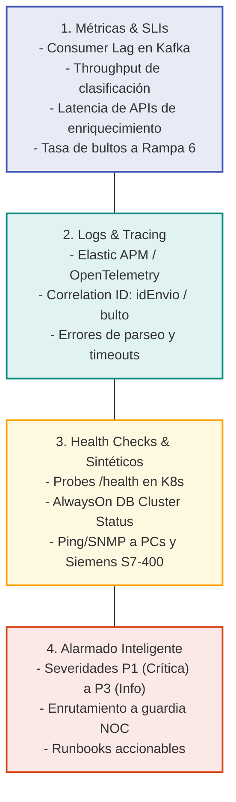

# 04. Estrategia de Observabilidad Integral para Sorters

## 1. Objetivos y Alcance
La observabilidad del ecosistema de Sorters tiene como meta garantizar:
1. **Continuidad Operativa**: Asegurar que los paquetes fluyan sin cuellos de botella desde su ingesta digital hasta su clasificación física.
2. **Detección Temprana de Fallas Silenciosas**: Identificar anomalías donde el hardware sigue funcionando pero el software perdió sincronización (ej. "Tablero en Cero"), o donde las dependencias externas degradan el ruteo.
3. **Reducción del MTTR (Mean Time to Resolution)**: Brindar a los equipos de soporte y guardia alertas claras con contexto y runbooks precisos de resolución.

---

## 2. Los Cuatro Pilares de Observabilidad



<details>
<summary><b>Haz clic aquí para ver o editar el código fuente Mermaid</b></summary>


</details>

---

## 3. Indicadores Clave de Servicio (SLIs / SLOs)

| Indicador (SLI) | Componente Objetivo | Umbral Normal | Umbral Advertencia (Warning) | Umbral Crítico (Critical) |
| :--- | :--- | :--- | :--- | :--- |
| **Consumer Lag (Kafka)** | `spp-altas-suscriber` | < 100 mensajes | 100 - 1.000 mensajes | > 1.000 mensajes durante > 5 min |
| **Consumer Lag (Kafka)** | `spptovertical-suscriber` | < 50 mensajes | 50 - 300 mensajes | > 300 mensajes durante > 3 min |
| **Latencia P95 de Enriquecimiento** | `spp-altas-api` -> NDD / Geo | < 250 ms | 250 ms - 800 ms | > 1.200 ms durante > 3 min |
| **Throughput de Retorno** | `verticaltoSpp-publisher` | > 0 bultos/min (en horario operativo) | 0 bultos/min durante 5 min con cinta activa | 0 bultos/min durante > 10 min |
| **Tasa de Desvío a Rampa 6** | `tb_evento` (Integración Vertical) | < 1.5% del total de bultos | 1.5% - 5% | > 5% del volumen en 1 hora |
| **Latencia de Replicación AlwaysOn**| `DBSORTER` (Nodo 2) | < 2 segundos | 2s - 15s | > 30s o estado `DISCONNECTED` |
| **Conectividad a Redis Cursor** | `verticaltoSpp-publisher` | Conectado / PING PONG | Latencia Redis > 20ms | Desconexión / Error de autenticación |
| **Disponibilidad de PC Sorter** | `PC100454` (`10.20.48.108`) | ICMP Ping < 10ms | Ping 10 - 50ms | Pérdida de paquetes > 20% o No Host |

---

## 4. Matriz de Alarmado y Severidad

### 🔴 P1 - Crítica (Impacto Operativo Inmediato / Planta Ciegas o Parada)
- **Tiempo de Respuesta (SLA)**: < 15 minutos.
- **Ruta de Escalamiento**: NOC -> Guardia Observabilidad -> Guardia Desarrollo SPP / Infraestructura.

| Condición Monitoreada | Señal de Detección | Impacto en Negocio | Acción Inmediata (Runbook) |
| :--- | :--- | :--- | :--- |
| **Caída de Réplica de `DBSORTER`** | Estado de sincronización AlwaysOn `NOT SYNCHRONIZING` o probe de conexión fallido. | Los tableros `spp-dashboard-ui` fallan o se congelan. La supervisión de planta queda a ciegas. | Verificar salud del nodo secundario SQL Server. Si no recupera, conmutar temporalmente la cadena de conexión de `reportes-api` al nodo primario con autorización de DBA. |
| **"Tablero en Cero" (`verticaltoSpp-publisher` inactivo)** | Pod en `CrashLoopBackOff`, error de conexión a SQL/Redis o métrica de publicación = 0 durante 10 min. | La máquina clasifica pero no se actualiza la trazabilidad. Se pierde el control de bultos clasificados y reportes de producción. | 1. Revisar logs del pod `verticaltoSpp-publisher`.<br/>2. Comprobar disponibilidad de Redis `DBSORTERPROD`.<br/>3. Reiniciar el deployment en K8s (`kubectl rollout restart deployment verticaltoSpp-publisher -n tyd-spp`). |
| **Acumulación Extrema de Lag en `spp-altas-suscriber`** | Lag en tópico Kafka > 5.000 mensajes creciendo sostenidamente. | Los envíos no llegan a `DBSORTER`. Cuando el bulto llega físicamente al arco de lectura, no existe orden y se expulsa masivamente a Rampa 6. | 1. Verificar latencia de `API Normalización (NDD)` y `API Geo`.<br/>2. Si las APIs externas están caídas o lentas, alertar al equipo de Domicilios/Geo.<br/>3. Escalar réplicas del worker si el consumo es CPU-bound. |
| **Pérdida de Conectividad con la PC Industrial / PLC** | Host `10.20.48.108` inalcanzable por ICMP / SNMP durante > 3 min. | Caída del clasificador físico o corte de red en planta CIT. | Contactar de inmediato a Mantenimiento Electromecánico y Soporte de Infraestructura en Planta CIT. |

---

### 🟡 P2 - Alta (Degradación de Servicio / Riesgo de Saturación)
- **Tiempo de Respuesta (SLA)**: < 1 hora.

| Condición Monitoreada | Señal de Detección | Impacto en Negocio | Acción Inmediata (Runbook) |
| :--- | :--- | :--- | :--- |
| **Incremento Anormal en Rampa 6** | Ratio de bultos a Rampa 6 > 5% en la última hora. | Sobrecarga de operarios recogiendo paquetes rechazados. Posible falla de sincronización de `spptovertical-suscriber` o demoras en TMS. | 1. Verificar estado de ejecución de `job-spptovertical`.<br/>2. Validar que no haya desfasajes de fecha/hora entre la base y el clasificador.<br/>3. Revisar logs de escáner en búsqueda de etiquetas ilegibles. |
| **Degradación de APIs de Enriquecimiento** | HTTP 5xx o timeout > 2s en API NDD o API Sucursales. | Retardo en la ingesta y clasificación automática. | Alertar al equipo de Canales / APIs Core y activar circuit breaker o modo de degradación controlada si está disponible. |
| **Almacenamiento en Bases de Datos > 85%** | Espacio en disco de `DBSORTER` o `Integración Vertical` próximo a saturación. | Riesgo de suspensión de escrituras SQL y parada completa de operaciones. | Ejecutar rutinas de purga/historificación de bultos mayores a 30 días con el equipo DBA. |

---

### 🟢 P3 - Media / Informativa (Advertencias y Mantenimiento)
- **Tiempo de Respuesta (SLA)**: Horario hábil / siguiente ciclo.

| Condición Monitoreada | Señal de Detección | Impacto en Negocio | Acción Inmediata |
| :--- | :--- | :--- | :--- |
| **Reinicios aislados de Pods** | Eventos `OOMKilled` o reinicios esporádicos en workers secundarios. | Ninguno visible si la réplica absorbe el tráfico. | Ajustar memory/CPU limits en los manifiestos de Kubernetes. |
| **Desvío de Tópicos Secundarios** | Lag moderado en `spp.cambio-destino` o `geocerca-consumer`. | Demoras menores en recanalizaciones. | Monitorear evolución y rebalanceo de particiones Kafka. |

---

## 5. Puntos de Control y Trazabilidad Distribuida

Para seguir el ciclo de vida de un paquete de punta a punta, se establece el estándar de instrumentación mediante **Elastic APM** y **OpenTelemetry** propagando los siguientes identificadores en todos los headers HTTP y metadata de Kafka:

```text
[Header HTTP / Kafka Metadata]
X-Trace-Id:       GUID de trazabilidad distribuida
X-Andreani-Envio: Número de Envío único (ej. 000001234567)
X-Andreani-Bulto: Número de Bulto físico (ej. 000001234567-01)
```

### Consultas Rápidas para Diagnóstico en Kibana / Elastic APM:
- **Trazar un bulto específico en todos los servicios:**
  ```kql
  labels.bulto: "000001234567-01" or message: "*000001234567-01*"
  ```
- **Identificar cuellos de botella en la ingesta del Vertical Sorter:**
  ```kql
  service.name: "verticaltoSpp-publisher" and log.level: "error"
  ```
- **Analizar rechazos hacia Rampa 6:**
  ```kql
  service.name: "job-spptovertical" and message: "*rampa 6*"
  ```

---

## 6. Monitoreo del Software del Proveedor (Optisoft / Optimus)

Dado que Optisoft es un componente propietario provisto por un tercero brasileño sin instrumentación APM nativa:

1. **Heartbeat Sintético por Base de Datos**:
   - Monitorear periódicamente la columna `FechaModificacion` o estado de lectura en la tabla `tb_evento`.
   - Si existen bultos pendientes de clasificación y la fecha del último registro modificado por Optisoft supera los **5 minutos**, disparar alarma de **"Optisoft Inactivo / No Consume"**.
2. **Supervisión de Host**:
   - Monitoreo mediante Zabbix / Telegraf en la PC `PC100454`:
     - Estado del proceso del ejecutable de Optisoft.
     - Uso de CPU y memoria RAM.
     - Conectividad TCP al puerto de base de datos SQL Server y al puerto Ethernet del PLC Siemens S7-400.
3. **Canal de Escalamiento con Proveedor**:
   - Contacto técnico directo (Celso / equipo de soporte del fabricante) según lo definido en los acuerdos de servicio para soporte de nivel 3.
