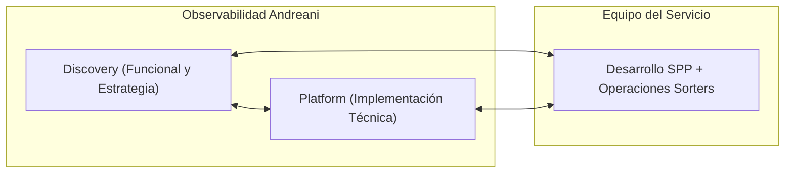
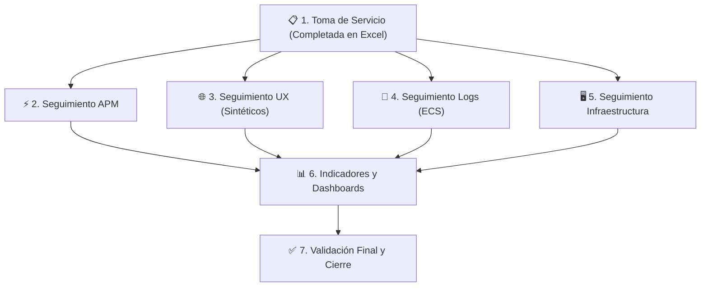
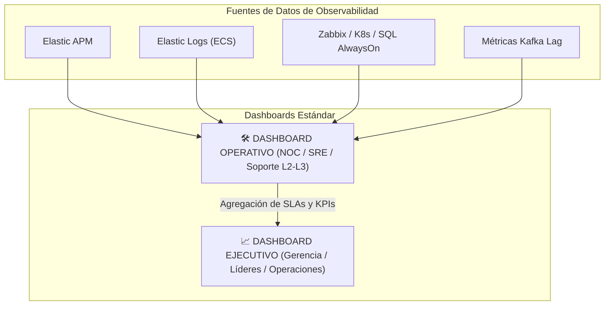

# 04. Estrategia de Observabilidad: Ecosistema Sorters

> 📋 **Marco Metodológico Oficial:** Este documento implementa los lineamientos, roles y entregables definidos en el [**`Estándar de Incorporación de Servicios al Modelo de Observabilidad`**](../estandar-observabilidad/README.md) del Grupo Logístico Andreani.

---

## 1. Objetivo y Modelo de Gestión

El objetivo de esta estrategia es incorporar el **Ecosistema de Sorters y SPP** al **Modelo de Observabilidad de Andreani**, asegurando:
1. **Detección Temprana de Fallas Silenciosas**: Identificar desincronizaciones entre el hardware industrial y los microservicios antes de que impacten en la operación física.
2. **Continuidad Operativa**: Garantizar el flujo continuo de bultos desde la ingesta digital en SPP hasta su clasificación y expulsión física.
3. **Reducción del MTTR (Mean Time to Resolution)**: Proveer a los equipos de soporte L2/L3, guardias y NOC alertas contextualizadas, consultas estándar y runbooks de contingencia.

### Modelo de Trabajo en Jira (Épica de Incorporación)
Siguiendo el estándar, el proceso se gestiona mediante una **única épica en Jira** articulada entre los tres actores clave:



- **Equipo Discovery (Aprobador / Responsable Funcional)**: Relevamiento técnico (Toma de Servicio), definición de la estrategia, consultas KQL estándar, diseño de dashboards operativos/ejecutivos y medición de adopción.
- **Equipo Platform (Responsable Técnico)**: Implementación de alertas, monitoreo de infraestructura (Zabbix/K8s/DBs), monitoreos sintéticos y ajuste de umbrales en la plataforma.
- **Equipo del Servicio (SPP / Sorters)**: Validación técnica, instrumentación de código y acompañamiento operativo.

---

## 2. Capacidades de Observabilidad Estandarizadas



---

### 2.1. Capacidad APM (Application Performance Monitoring)
* **Responsable:** Discovery | **Ejecuta:** Platform y Desarrollo SPP.
* **Estándar Tecnológico:** Agente **Elastic APM** y propagación de traza distribuida.
* **Alcance:**
  1. Instrumentación de microservicios .NET en Kubernetes (`TYD-SPP` y `TYD-SORTERS`).
  2. Inyección de cabeceras de trazabilidad en HTTP y metadata de Apache Kafka:
     ```text
     X-Trace-Id:       GUID único de trazabilidad distribuida (OpenTelemetry / W3C TraceContext)
     X-Andreani-Envio: Código de Envío (ej. 000001234567)
     X-Andreani-Bulto: Número de Bulto individual (ej. 000001234567-01)
     ```
  3. Mapeo de transacciones distribuidas desde `spp-altas-suscriber` hasta `verticaltospp-publisher`.
* **Entregable:** Dashboard estándar de APM y alertas de latencia/errores 5xx operativas.

---

### 2.2. Capacidad UX y Monitoreo Sintético
* **Responsable:** Discovery | **Ejecuta:** Platform.
* **Estándar Tecnológico:** Heartbeats sintéticos y sondas periódicas.
* **Alcance:**
  1. **Disponibilidad de UIs Operativas:** Monitoreo sintético HTTP/HTTPS de disponibilidad y tiempo de carga de:
     - `spp-ui` (Portal general de SPP).
     - `spp-dashboard-ui` (Tablero de supervisión en planta).
     - `trackinginternoui` (App móvil de pistoleo en nave).
  2. **Heartbeat Sintético para Software de Fabricante (Caja Negra):**  
     Al no contar con APM nativo en el software del fabricante del Sorter, se ejecuta una sonda periódica que evalúa la columna `FechaModificacion` en la tabla `tb_evento`. Si hay bultos pendientes y no hay actualización en más de **5 minutos**, se alerta anomalía en el software de inducción.
* **Entregable:** Dashboard UX con métricas de disponibilidad (%) y alertas de caída de frontends.

---

### 2.3. Capacidad Logs y Trazabilidad
* **Responsable:** Discovery | **Ejecuta:** Platform y Desarrollo SPP.
* **Estándar Tecnológico:** Elasticsearch / Kibana con formato **ECS (Elastic Common Schema)**.
* **Alcance:**
  1. Formato estructurado JSON en todos los pods con campos obligatorios: `log.level`, `service.name`, `trace.id`, `labels.envio`, `labels.bulto`.
  2. **Consultas Estándar de Diagnóstico Rápido en Kibana:**
     - **Trazar un bulto en todos los microservicios:**
       ```kql
       labels.bulto: "000001234567-01" or message: "*000001234567-01*"
       ```
     - **Filtrar errores en la publicación al clasificador:**
       ```kql
       service.name: "verticaltospp-publisher" and log.level: "error"
       ```
     - **Auditar paquetes derivados a Rampa 6 (Loop de Resiliencia):**
       ```kql
       service.name: "job-spptovertical" and message: "*rampa 6*"
       ```
* **Entregable:** Dashboard estándar de logs con volumetría de errores y búsqueda guiada.

---

### 2.4. Capacidad Monitoreo de Infraestructura
* **Responsable:** Platform | **Participa:** Discovery y Equipo del Servicio.
* **Estándar Tecnológico:** **Zabbix** y agentes Telegraf / Prometheus.
* **Alcance:**
  1. **Clusters de Cómputo (CCE / AKS-BR):** Estado de pods, reinicios inesperados (`CrashLoopBackOff`), saturación de CPU/Memoria en namespace `tyd-spp`.
  2. **Bases de Datos Relacionales (SQL Server AlwaysOn):**
     - Monitoreo del grupo de disponibilidad `DBSORTER` (Nodo 1 y Réplica Nodo 2).
     - Alarma inmediata si el estado pasa a `NOT SYNCHRONIZING` o si el lag de réplica supera **15 segundos**.
  3. **Caché y Cursor de Estado (Redis `DBSORTERPROD`):** Memoria utilizada, conexiones cliente y respuesta a comando `PING`.
  4. **Mensajería Asíncrona (Apache Kafka):** Lag de grupos de consumidores (`consumer-lag`) en tópicos `spp.alta-envio`, `spp.apto-para-consolidar`, etc.
  5. **Hardware Industrial y PCs de Planta:**
     - Conectividad de red (ICMP/SNMP) con la PC de control `PC100454` (`10.20.48.108`) y switches industriales.
* **Entregable:** Dashboard de infraestructura y alarmas operativas en Zabbix / Alertmanager.

---

## 3. Indicadores Operativos y de Negocio (Dashboards)

Siguiendo las directrices del estándar de la organización, la información visual se divide estrictamente entre **visión operativa** y **visión ejecutiva**:



### 3.1. Dashboard Operativo (Para Soporte L2/L3, Guardias y NOC)
* **Finalidad:** Detección en tiempo real, diagnóstico de cuellos de botella y resolución ágil de incidentes.
* **Métricas y Paneles:**
  - **Consumer Lag por Tópico Kafka:** Alerta visual si `spp-altas-suscriber` o `spptovertical-suscriber` superan 500 mensajes de retraso.
  - **Tasa de Expulsión a Rampa 6:** Porcentaje de bultos derivados a la rampa de desvío (normal < 1.5%).
  - **Salud del Worker de Retorno (`verticaltoSpp-publisher`):** Monitoreo de actividad de clasificación en vivo para evitar el fenómeno "Tablero en Cero".
  - **Estado de Sincronización AlwaysOn SQL Server:** Latencia de réplica y estado de conectividad entre nodos.
  - **Logs de Error en Tiempo Real:** Filtro de excepciones `5xx` agrupadas por microservicio.

### 3.2. Dashboard Ejecutivo (Para Gerencia, Líderes Técnicos y Negocio)
* **Finalidad:** Seguimiento consolidado de la salud del servicio, cumplimiento de objetivos y capacidad instalada.
* **Métricas y Paneles:**
  - **SLO de Disponibilidad Global:** Meta mínima de **99.5%** de tiempo operativo sin interrupciones del circuito.
  - **Throughput de Clasificación:** Cantidad de bultos clasificados por hora vs. capacidad teórica del clasificador.
  - **Tasa de Eficiencia de Clasificación (First-Pass Sort):** Porcentaje de paquetes clasificados al primer intento sin pasar por Rampa 6 (Objetivo > 98%).
  - **Cumplimiento de Ventanas Operativas (SLA):** Tiempos medios de procesamiento de bultos desde el ingreso a nave hasta la salida a troncal.

---

## 4. Matriz de Alarmado y Niveles de Severidad

| Severidad | SLA Respuesta | Canales de Notificación | Condiciones Típicas de Disparo |
| :---: | :---: | :--- | :--- |
| **🔴 P1 - Crítica** | **< 15 min** | NOC, Guardia Observabilidad, Llamada automática, Teams Urgencias | • Caída de réplica de base `DBSORTER` (AlwaysOn roto).<br/>• "Tablero en Cero": Sorter clasifica pero no hay trazabilidad.<br/>• Acumulación de Lag Kafka > 5.000 mensajes sostenido.<br/>• Corte de conectividad con PC industrial / PLC (`10.20.48.108`). |
| **🟡 P2 - Alta** | **< 1 hora** | Canal Teams Observabilidad, Alerta Zabbix / Elastic | • Incremento anormal de desvíos a Rampa 6 (> 5% en 1 hora).<br/>• Latencia de réplica AlwaysOn entre 5 y 15 segundos.<br/>• Espacio en disco de bases de datos > 85%.<br/>• Degradación de APIs de normalización de domicilio / Geo. |
| **🔵 P3 - Media / Informativa** | **< 4 horas** | Ticket de seguimiento, Notificación por correo | • Reinicio esporádico de un pod de worker sin impacto en cola.<br/>• Variaciones menores de cobertura de pruebas.<br/>• Advertencia preventiva de memoria en pods. |

---

## 5. Criterios de Finalización y Validación de la Épica

De acuerdo con el estándar de incorporación, la observabilidad del ecosistema de Sorters se considerará **formalmente cerrada** cuando se cumplan los 9 criterios:
- [x] **Toma de Servicio validada:** Relevamiento consolidado en `relevamiento/planillas/Toma_de_Servicio - Sorters.xlsx`.
- [x] **Catálogo de Componentes relevado:** Microservicios SPP y repositorios mapeados en `03. Catálogo de Componentes` y `06. Ecosistema SPP`.
- [ ] **Instrumentación APM verificada:** Trazas distribuidas confirmadas en ambiente productivo CCE.
- [ ] **Estrategia de Logs estandarizada:** Logs en formato ECS con labels de `bulto` y `envio`.
- [ ] **Monitoreos Sintéticos activos:** Probes de UIs operativas y heartbeat de base de datos de Sorter.
- [ ] **Monitoreo de Infraestructura configurado:** Templates Zabbix en K8s, SQL AlwaysOn y PC industrial.
- [ ] **Dashboard Operativo publicado:** Tablero disponible para supervisión de planta CIT y NOC.
- [ ] **Dashboard Ejecutivo publicado:** KPIs de disponibilidad y bultos/hora para líderes.
- [ ] **Validación Final firmada:** Aprobación conjunta entre el Equipo de Observabilidad y el Equipo del Servicio.
