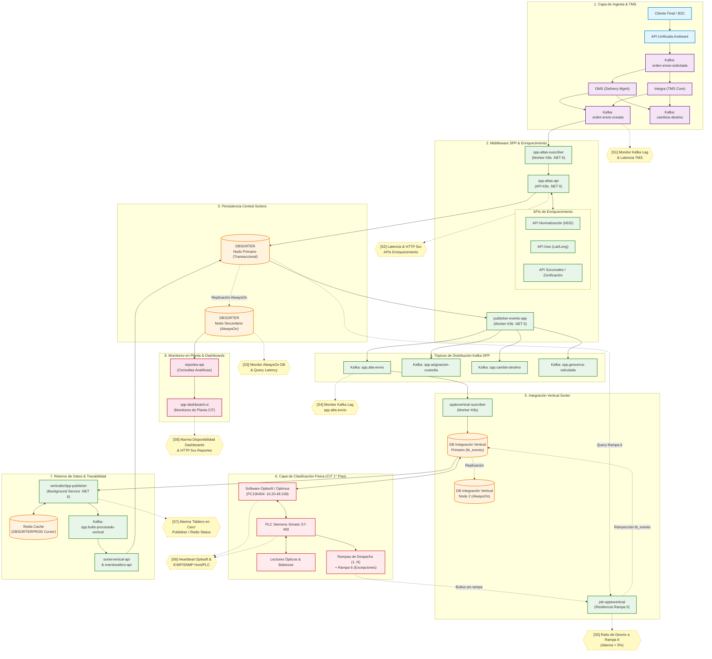

# Diagrama End-to-End de Observabilidad: Ecosistema Sorters

Este documento contiene el **mapa integral de observabilidad** del circuito de Sorters, con foco en el **Vertical Sorter (CIT 1° Piso)**. Representa el flujo de información y paquetería de punta a punta, señalizando los **puntos de control y sensores de monitoreo (S1 a S10)** recomendados para la instrumentación.

---

## 🗺️ Diagrama de Arquitectura y Puntos de Control

> 💡 **Formatos disponibles para ver el diagrama con flechas y colores:**
> - 🌐 **Visor Interactivo:** Abrir [`diagrama-flujo-observabilidad.html`](./diagrama-flujo-observabilidad.html) en tu navegador con zoom y navegación.
> - 🖼️ **Imagen Vectorial:** Abrir [`diagrama-flujo-observabilidad.svg`](./diagrama-flujo-observabilidad.svg) o [`diagrama-flujo-observabilidad.png`](./diagrama-flujo-observabilidad.png).
> - 👁️ **En el Editor (IDE):** Presiona `Ctrl + Shift + V` (o `Ctrl + K, V`) para abrir la vista previa Markdown de este archivo.


<details>
<summary><b>Haz clic aquí para ver o editar el código fuente Mermaid</b></summary>


</details>

---

## 🎯 Catálogo de Sensores y Puntos de Control

| Sensor | Punto del Flujo | Métrica / Señal Monitoreada | Severidad y Criterio de Alarma |
| :--- | :--- | :--- | :--- |
| **[S1]** | Ingesta Kafka (`orden-envio-creada`) | Consumer Lag de `spp-altas-suscriber`. | **P1**: Lag > 1.000 mensajes sostenido por más de 5 minutos. |
| **[S2]** | APIs de Enriquecimiento (NDD / Geo / Sucursales) | Latencia HTTP P95 y tasa de error HTTP 5xx. | **P2**: Latencia > 800 ms o tasa de error > 2% durante 3 minutos. |
| **[S3]** | Clúster `DBSORTER` (AlwaysOn) | Estado de replicación del nodo secundario (Réplica de lectura). | **P1**: Estado `NOT SYNCHRONIZING` o réplica inalcanzable (afecta tableros). |
| **[S4]** | Tópico Kafka `spp.alta-envio` | Consumer Lag de `spptovertical-suscriber`. | **P2**: Lag > 300 mensajes. Retraso en la preparación de bultos en Vertical. |
| **[S5]** | Resiliencia Rampa 6 (`job-spptovertical`) | Porcentaje de paquetes desviados a Rampa 6 respecto al total clasificado. | **P2**: Tasa de Rampa 6 > 5% en la última hora (indica fallas de pre-sincronización o etiquetas rotas). |
| **[S6]** | Software Proveedor y Hardware (Optisoft + Siemens S7-400) | Actividad de polling en `tb_evento`, ICMP Ping a `10.20.48.108` y SNMP a PLC. | **P1**: Sin actualización en `tb_evento` con bultos en cola > 5 min, o Host inalcanzable. |
| **[S7]** | Publicador de Retorno (`verticaltoSpp-publisher`) | Estado del Pod en K8s, conectividad a Redis (`DBSORTERPROD`) y tasa de eventos emitidos. | **P1**: Pod caído o 0 bultos emitidos durante 10 min en franja operativa ("Tablero en Cero"). |
| **[S8]** | Tableros Operativos (`spp-dashboard-ui`) | Disponibilidad HTTP 200 y tiempo de carga de vistas de supervisor. | **P2**: UI no accesible o `reportes-api` devolviendo errores de timeout. |
| **[S9]** | Tópico de Custodia (`spp.asignacion-custodia`) | Lag de consumo de sorters regionales e in-house (Giops). | **P3**: Lag elevado en sucursales particulares (aislamiento de red en planta remota). |
| **[S10]** | Sincronización de Modificaciones (`spp.cambio-destino`) | Latencia de impacto de redirecciones solicitadas por clientes. | **P3**: Demora en la actualización de paquetes que cambiaron de sucursal. |

---

## 🛡️ Matriz de Mitigación de Puntos Únicos de Falla (SPOF)

```text
+------------------------------------+-------------------------------------------+----------------------------------------------+
| Componente Crítico                 | Modo de Falla                             | Mecanismo de Resiliencia Implementado        |
+------------------------------------+-------------------------------------------+----------------------------------------------+
| spp-altas-api                      | Caída de API NDD / Geo                    | Encolamiento en Kafka + Reintentos con Backoff|
| Integración Vertical               | Bulto antiguo depurado (> 15/30 días)     | Rampa 6 física + job-spptovertical (polling) |
| verticaltoSpp-publisher            | Caída de conexión a Redis Cursor          | Resguardo de offset en memoria + reconexión  |
| DBSORTER (Primario)                | Falla de hardware en servidor SQL         | Conmutación por error automática (AlwaysOn)  |
| DBSORTER (Réplica de Lectura)      | Desincronización o reinicio de réplica    | Fallback controlado hacia nodo primario      |
+------------------------------------+-------------------------------------------+----------------------------------------------+
```
