# 🎨 Catálogo de Diagramas de Arquitectura y Observabilidad

Este directorio centraliza todos los **diagramas vectoriales (SVG), renders gráficos (PNG) y visores interactivos (HTML)** desarrollados para el ecosistema de Sorters de Andreani Logística.

Todos los diagramas siguen estrictamente la paleta cromática corporativa **Cartesian** (Rojo Andreani `#d71920`, Azul Marino `#1f2856`, Neutros `#fafafa`/`#dfe1e3`) y la tipografía oficial **Rubik** y **Roboto**.

---

## 🧭 Índice de Diagramas

| Diagrama | Formato | Documento que lo utiliza | Descripción |
| :--- | :---: | :--- | :--- |
| [**`arquitectura-resumida.svg`**](./arquitectura-resumida.svg) | SVG | [Home Page (`README.md`)](../../README.md) | Visión macro de integración: TMS (DMS/Integra) -> SPP -> Kafka -> Vertical Sorter -> AlwaysOn -> Dashboards. |
| [**`tipologia-sorters.svg`**](./tipologia-sorters.svg) | SVG | [01. Arquitectura General](../01-arquitectura-general.md) | Cuadro comparativo de las 5 tecnologías de Sorters en la compañía (Vertical, TruxSorter, Wayzim, Giops, Regionales). |
| [**`capas-tecnologicas.svg`**](./capas-tecnologicas.svg) | SVG | [01. Arquitectura General](../01-arquitectura-general.md) | Diagrama de las 5 capas de la solución: TMS/Canales, Middleware SPP, Mensajería/Bases, Clasificación Física y Monitoreo. |
| [**`flujo-vertical.svg`**](./flujo-vertical.svg) | SVG | [02. Flujo E2E Vertical](../02-flujo-end-to-end-vertical.md) | Diagrama de secuencia detallado de las 6 fases del Vertical Sorter, incluyendo el loop de resiliencia de Rampa 6. |
| [**`pilares-observabilidad.svg`**](./pilares-observabilidad.svg) | SVG | [04. Estrategia Observabilidad](../04-estrategia-observabilidad.md) | Los cuatro pilares de observabilidad para Sorters: Métricas SLI/SLO, Logs/APM, Health Checks Sintéticos y Matriz de Alarmas P1-P3. |
| [**`diagrama-flujo-observabilidad.svg`**](./diagrama-flujo-observabilidad.svg) | SVG | [05. Flujo Observabilidad](../05-flujo-observabilidad.md) | Mapa de flujo end-to-end con la ubicación exacta de los 10 sensores de monitoreo recomendados (S1 a S10). |
| [**`diagrama-flujo-observabilidad.png`**](./diagrama-flujo-observabilidad.png) | PNG | [05. Flujo Observabilidad](../05-flujo-observabilidad.md) | Render rasterizado de alta definición del mapa de observabilidad para visualización compatible sin soporte SVG. |
| [**`diagrama-flujo-observabilidad.html`**](./diagrama-flujo-observabilidad.html) | HTML | [05. Flujo Observabilidad](../05-flujo-observabilidad.md) | Visor web interactivo independiente con zoom pan/pinch y visualización en tiempo real. |

---

## 🖼️ Vistas Previas

### 1. Arquitectura Resumida

---

### 2. Tipología de Sorters

---

### 3. Capas Tecnológicas

---

### 4. Flujo End-to-End Vertical Sorter y Rampa 6

---

### 5. Cuatro Pilares de Observabilidad

---

### 6. Mapa Completo de Sensores de Observabilidad (S1 a S10)

