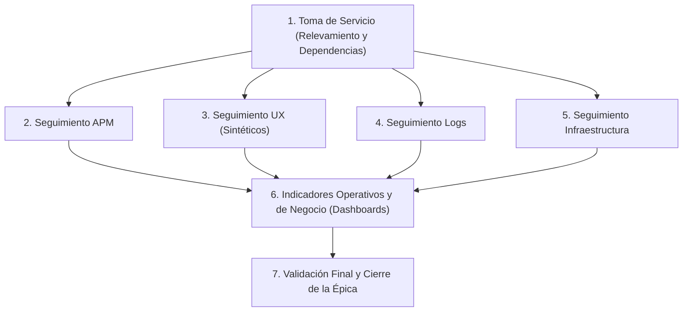
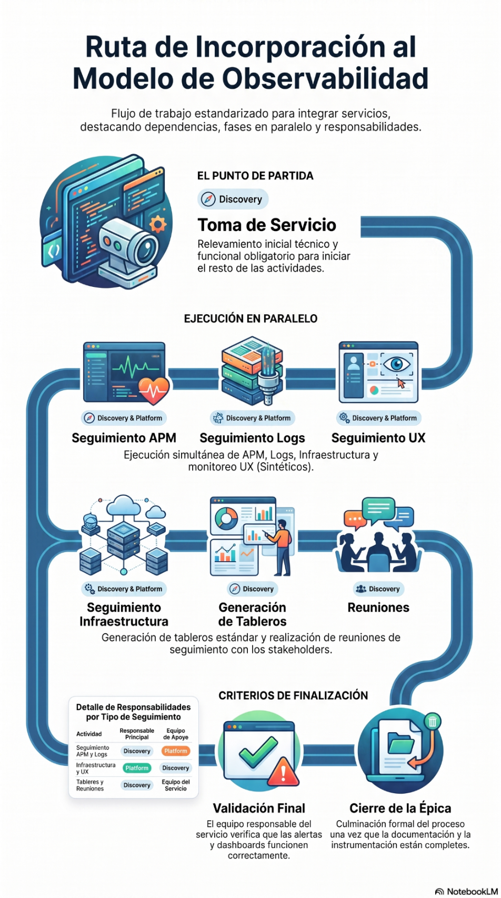

# Estándar de Incorporación de Servicios al Modelo de Observabilidad

> 📄 **Documento Oficial de Gobierno de Observabilidad - Grupo Logístico Andreani**  
> **Archivo fuente:** [`Estándar de Incorporación de Servicios al Modelo de Observabilidad.docx`](./Estándar%20de%20Incorporación%20de%20Servicios%20al%20Modelo%20de%20Observabilidad.docx)  
> **Repositorio de origen:** SharePoint Observabilidad Andreani  

---

## 1. Objetivo

Establecer el **proceso estándar** para incorporar un servicio al modelo de observabilidad de la organización, definiendo las actividades, responsabilidades, entregables y criterios necesarios para implementar o validar las capacidades de monitoreo, alarmado y visualización de información.

Asimismo, este documento formaliza la gestión del proceso mediante la estandarización de las **épicas, historias, tareas y entregables utilizados en Jira**, asegurando un criterio uniforme para todas las incorporaciones de servicios.

El objetivo final es que todos los servicios cuenten con un nivel homogéneo de observabilidad que permita:
- Detectar incidentes de manera temprana.
- Facilitar el análisis de causa raíz.
- Realizar el seguimiento continuo de disponibilidad, rendimiento y comportamiento operativo.

---

## 2. Alcance

Este estándar aplica a todos los servicios que deban incorporarse o adecuarse al modelo de observabilidad definido por el Equipo de Observabilidad de Andreani:
- **Servicios nuevos.**
- **Servicios existentes.**
- **Servicios que requieran actualizar su implementación de observabilidad.**

---

## 3. Objetivos del Proceso

Durante la incorporación de un servicio se busca:
1. Comprender la arquitectura y funcionamiento del servicio.
2. Identificar responsables técnicos y funcionales.
3. Validar o implementar **APM (Application Performance Monitoring)**.
4. Garantizar la disponibilidad de **logs, métricas y trazas**.
5. Implementar monitoreo de **experiencia de usuario (UX / Sintéticos)**.
6. Verificar el **monitoreo de infraestructura** asociada.
7. Implementar **alertas técnicas y funcionales**.
8. Construir **dashboards estandarizados** (operativos y ejecutivos).
9. Documentar la solución implementada.

---

## 4. Roles y Responsabilidades

El **Equipo de Observabilidad** se encuentra dividido en dos equipos con responsabilidades complementarias:

### 4.1. Equipo Discovery
Responsable de comprender el servicio y definir la estrategia de observabilidad:
- Realizar la **Toma de Servicio**.
- Relevar la arquitectura del servicio.
- Identificar componentes y dependencias.
- Analizar la implementación de APM.
- Validar logs, métricas y trazas.
- Diseñar e implementar dashboards.
- Definir indicadores técnicos y de negocio.
- Mantener la documentación actualizada.
- Coordinar reuniones con los equipos responsables.

### 4.2. Equipo Platform
Responsable de implementar y mantener las capacidades técnicas de monitoreo sobre la plataforma de observabilidad:
- Configuración de alarmas.
- Implementación de monitoreos sintéticos.
- Configuración del monitoreo de infraestructura.
- Ajuste de umbrales.
- Configuración de alertas técnicas y de negocio.
- Administración de la plataforma de observabilidad.

### 4.3. Equipo Responsable del Servicio (Desarrollo / Operaciones)
Es responsable de:
- Proveer la información requerida durante la Toma de Servicio.
- Acompañar las implementaciones cuando sea necesario.
- Validar los entregables obtenidos.
- Informar cambios funcionales o técnicos relevantes del servicio.

### 4.4. Matriz de Responsabilidades (RACI)

| Historia / Actividad | Discovery | Platform | Equipo del Servicio |
| :--- | :---: | :---: | :---: |
| **Toma de Servicio** | **A / R** | R | R |
| **Seguimiento APM** | **A / R** | R | R |
| **Seguimiento UX** | **A / R** | R | C |
| **Seguimiento Logs** | **A / R** | R | C |
| **Seguimiento Infraestructura** | A / R | **R** | C |
| **Indicadores Operativos y de Negocio** | **A / R** | C | C |
| **Validación Final** | R | R | **A** |

> *Referencias: **A** = Aprobador (Accountable) | **R** = Responsable de ejecución (Responsible) | **C** = Consultado (Consulted)*  
> *Nota: El equipo Discovery actúa como responsable funcional del proceso de incorporación al modelo de observabilidad.*

---

## 5. Modelo de Gestión en Jira

- Cada incorporación de un servicio deberá gestionarse mediante **una única épica en Jira**.
- La épica representa el ciclo completo de incorporación del servicio al modelo de observabilidad.
- Dentro de cada épica se crearán las historias necesarias para implementar o validar las distintas capacidades de observabilidad.
- Las tareas específicas de **Discovery** y **Platform** se gestionarán como **subtareas** dentro de cada historia.

---

## 6. Flujo del Proceso

La incorporación comienza con la historia **Toma de Servicio**, la cual constituye la **única dependencia obligatoria** para el inicio del resto de las historias. Una vez validada la información, las demás historias pueden ejecutarse en paralelo:





---

## 7. Historias del Proceso

### 7.1. Historia: Toma de Servicio
- **Objetivo:** Relevar la información funcional y técnica del servicio para comprender su funcionamiento y establecer la base para la observabilidad.
- **Responsable:** Discovery | **Participantes:** Platform, Equipo del Servicio.
- **Alcance:** Relevamiento técnico y funcional, identificación de componentes, dependencias, responsables, tecnologías, infraestructura y consolidación.
- **Entregable:** Documento de Toma de Servicio validado.
- **Criterio de Aceptación:** La Toma de Servicio fue completada, validada con el equipo responsable y contiene la información necesaria para iniciar las demás historias.

### 7.2. Historia: Seguimiento APM
- **Objetivo:** Implementar o validar la adopción del estándar de observabilidad para APM.
- **Responsable:** Discovery | **Participantes:** Platform, Equipo del Servicio.
- **Alcance:** Seguimiento de implementación de agentes APM, acompañamiento al equipo, medición del grado de adopción, generación del dashboard estándar y configuración de alertas.
- **Entregable:** Servicio instrumentado conforme al estándar de APM, con dashboard y alertas operativas.
- **Criterio de Aceptación:** El servicio cumple con el estándar de APM vigente, alertas operativas y dashboard estándar reflejando el estado de instrumentación.

### 7.3. Historia: Seguimiento UX
- **Objetivo:** Implementar el monitoreo de disponibilidad y experiencia de usuario mediante monitoreos sintéticos.
- **Responsable:** Discovery | **Participantes:** Platform, Equipo del Servicio.
- **Alcance:** Implementación de monitoreos sintéticos, configuración de alertas, generación del dashboard estándar de UX y validación.
- **Entregable:** Monitoreo sintético operativo con dashboard y alertas asociadas.
- **Criterio de Aceptación:** Monitoreos sintéticos ejecutando correctamente, alertas funcionando según lo esperado y dashboard con disponibilidad.

### 7.4. Historia: Seguimiento Logs
- **Objetivo:** Garantizar la disponibilidad de información útil para el análisis operativo mediante logs estandarizados.
- **Responsable:** Discovery | **Participantes:** Platform, Equipo del Servicio.
- **Alcance:** Validación de estrategia de logging, revisión de registros, construcción de consultas estándar (KQL/Elasticsearch), generación del dashboard y adecuación de información.
- **Entregable:** Estrategia de observabilidad basada en logs implementada y validada.
- **Criterio de Aceptación:** El servicio genera los logs requeridos, las consultas estándar permiten analizar el comportamiento y el dashboard refleja la información necesaria.

### 7.5. Historia: Seguimiento Infraestructura
- **Objetivo:** Implementar o validar el monitoreo de los componentes de infraestructura asociados al servicio.
- **Responsable:** Platform | **Participantes:** Discovery, Equipo del Servicio.
- **Alcance:** Monitoreo y alarmado sobre infraestructura (Kubernetes, VMs, bases AlwaysOn, redes, etc.), dashboards estándar de infra.
- **Entregable:** Infraestructura monitoreada de acuerdo con el estándar establecido.
- **Criterio de Aceptación:** Componentes de infraestructura con monitoreo, alertas y visualización según estándares vigentes.

### 7.6. Historia: Indicadores Operativos y de Negocio
- **Objetivo:** Construir indicadores y tableros que consoliden información de las distintas capacidades para brindar una visión integral del comportamiento operativo y funcional.
- **Responsable:** Discovery | **Participantes:** Platform, Equipo del Servicio.
- **Alcance:** Construcción de dashboards operativos y/o ejecutivos, KPIs de negocio, SLOs, reportes automáticos y tableros de consolidación.
- **Entregable:** Dashboards e indicadores publicados y disponibles para los equipos involucrados.
- **Criterio de Aceptación:** Dashboards e indicadores implementados, validados y disponibles para el seguimiento operativo y funcional.

### 7.7. Historia: Reuniones
- **Objetivo:** Coordinar y dar seguimiento a las actividades de incorporación, facilitando la comunicación entre Observabilidad y el Servicio.
- **Responsable:** Discovery | **Participantes:** Platform, Equipo del Servicio.
- **Alcance:** Planificación y realización de reuniones, registro de acuerdos, responsables y acciones derivadas.
- **Entregable:** Acuerdos documentados, acciones registradas y seguimiento actualizado.

### 7.8. Historia: Validación Final
- **Objetivo:** Validar junto al equipo responsable que el servicio cumple con el modelo estándar de observabilidad y formalizar el cierre de la incorporación.
- **Responsable:** Equipo del Servicio | **Participantes:** Discovery, Platform.
- **Alcance:** Revisión conjunta de entregables, validación funcional y técnica, resolución de observaciones y cierre de la épica en Jira.
- **Entregable:** Servicio incorporado formalmente al modelo estándar de observabilidad.
- **Criterio de Aceptación:** El equipo responsable valida la implementación, se cumplen los criterios del estándar y se cierra la épica.

---

## 8. Criterios de Finalización de la Épica

Una épica se considerará finalizada cuando:
1. La **Toma de Servicio** se encuentre validada.
2. La implementación de **APM** haya sido realizada o validada.
3. Los **logs, métricas y trazas** se encuentren disponibles para su análisis.
4. Los **monitoreos sintéticos** hayan sido implementados cuando correspondan.
5. Las **alertas técnicas y funcionales** hayan sido configuradas y verificadas.
6. El **monitoreo de infraestructura** haya sido implementado o validado.
7. Los **dashboards** definidos para el servicio se encuentren publicados.
8. La **documentación** haya sido actualizada.
9. El equipo responsable del servicio haya **validado la implementación**.

---

## 9. Definiciones y Criterios del Modelo

### ¿Qué se considera un estándar?
Un **entregable reutilizable** definido por el Equipo de Observabilidad que puede aplicarse a cualquier servicio con mínimas adaptaciones (Dashboard estándar, Alarmas estándar, Consultas de logs estándar, Configuración estándar de APM).

### ¿Qué diferencia existe entre un Dashboard Operativo y un Dashboard Ejecutivo?

| Tipo de Dashboard | Objetivo Principal | Audiencia | Ejemplos de Métricas e Información |
| :--- | :--- | :--- | :--- |
| **Dashboard Operativo** | Facilitar la operación diaria del servicio, permitiendo detectar, diagnosticar y resolver incidentes con información técnica en tiempo real. | Operadores, Guardias, SRE, Soporte L2/L3 | Bases transaccionales, estado de colas, alarmas activas, logs de error, latencia por endpoint, tasas de error HTTP. |
| **Dashboard Ejecutivo** | Brindar una visión consolidada del estado del servicio desde la perspectiva del negocio y del cliente, evaluando impacto y cumplimiento de acuerdos. | Gerencias, Líderes Técnicos, Product Owners | Cumplimiento de SLA, disponibilidad (SLO), KPIs de negocio (bultos clasificados/hora), tendencias y satisfacción UX. |

### ¿Dónde deben implementarse los dashboards estándar?
Cada capacidad de observabilidad es responsable de construir su dashboard estándar:
- **APM:** Dashboard APM
- **UX:** Dashboard UX
- **Logs:** Dashboard Logs
- **Infraestructura:** Dashboard Infraestructura

Los dashboards que consolidan información de múltiples capacidades o incorporan indicadores de negocio corresponden a la historia **Indicadores Operativos y de Negocio**.

---

## 10. Anexos y Plantillas

### Anexo A: Plantilla de Toma de Servicio
- Archivo maestro en SharePoint: [**Acceder a Plantilla de Toma de Servicio**](https://grupologisticoandreani.sharepoint.com/:x:/t/Observabilidad/IQBZ1eERYsOSRqpS-hMiA1_LASsVvoNtbm5mJm_onm6DMR0?e=Ppx72L)
- Copia local en relevamiento: [`relevamiento/planillas/Toma_de_Servicio - Sorters.xlsx`](../relevamiento/planillas/Toma_de_Servicio%20-%20Sorters.xlsx)

### Anexo B: Plantillas de Comunicación y Correos

#### Primer Contacto – Equipo de Desarrollo
```text
ASUNTO: [OBSERVABILIDAD] {Nombre de servicio}

Hola equipo,

Queremos informarles que estaremos iniciando el proceso de incorporación del servicio {Nombre del servicio} al modelo estándar de Observabilidad.

Como primera etapa, les compartimos el documento de Toma de Servicio, el cual nos permitirá relevar la información funcional y técnica necesaria para planificar las actividades de observabilidad del servicio.

El objetivo de este proceso es que el servicio cuente con un esquema de observabilidad que permita anticipar incidentes, identificar rápidamente la causa de los problemas y monitorear de forma continua la salud del servicio y de los procesos más importantes para el negocio.

Como resultado del proceso, el servicio dispondrá de las capacidades de observabilidad necesarias para su seguimiento, incluyendo métricas, trazas, logs, monitoreo de experiencia de usuario (UX), monitoreo de infraestructura, alertas y dashboards estandarizados.

Les solicitamos completar o actualizar la información requerida en las distintas secciones del documento. Al estar alojado en SharePoint, las modificaciones se reflejarán automáticamente.

Etapas del proceso:
1. Toma de Servicio: análisis de la información relevada.
2. Seguimiento APM: observabilidad de la aplicación.
3. Seguimiento UX: experiencia de usuario.
4. Seguimiento Logs: estrategia de logging.
5. Seguimiento Infraestructura: monitoreo de soporte (K8s, bases, middleware, redes).
6. Indicadores Operativos y de Negocio: dashboards personalizados a demanda.
7. Validación Final: revisión y cierre de la incorporación.

Saludos,
Equipo de Observabilidad
```

#### Primer Contacto – Infraestructura
```text
ASUNTO: [OBSERVABILIDAD] {Nombre de servicio} – Validación interna

Hola equipo,

Como parte del proceso de incorporación del servicio {Nombre del servicio} al Modelo de Observabilidad, les compartimos la Toma de Servicio que fue completada por el equipo de desarrollo.

Les solicitamos revisar la información correspondiente a infraestructura y, de ser necesario, realizar las correcciones, actualizaciones o incorporar la información que consideren relevante para reflejar el estado actual del servicio (Kubernetes, bases de datos, Kafka, Cloudflare, redes, VMs).

Una vez recibidas sus observaciones, consolidaremos la documentación para continuar con las siguientes etapas del proceso.

Saludos,
Equipo de Observabilidad
```
